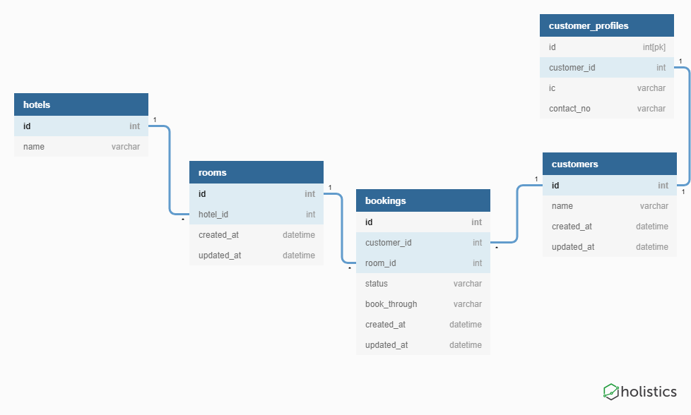
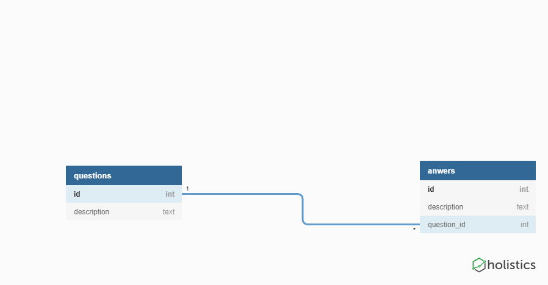
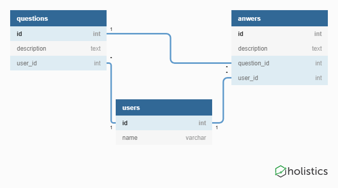
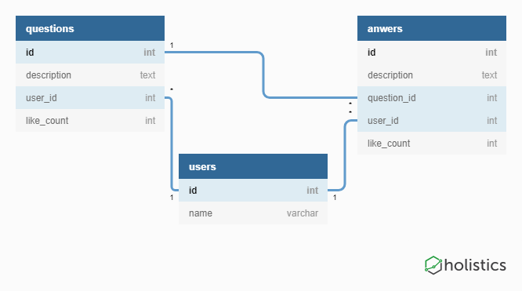
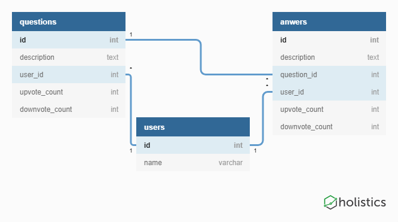
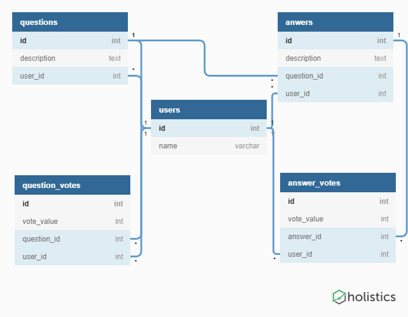
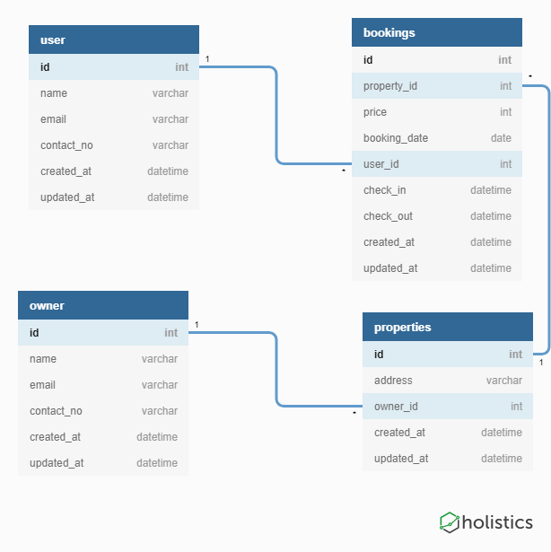
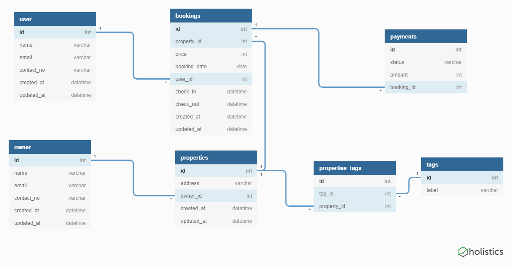

### Creating Databases, Schemas and Executing Queries
- with Microsoft SQL Server Management Studio (SSMS)

+++

#### Hotel Schema


+++

#### Creating Databases
- Steps:
    1. Open SSMS and connect to localhost
    2. Right-click on `Databases` and select `New Databases`
    3. Provide a name to the database and click Ok

+++

#### Creating Schema
- Steps:
    1. Expand the created database
    2. Right-click on `Tables` and select `New Table`
    3. Fill in Column Names and Types
    4. Right click on a Column to set as `primary key`
    5. Right click on a Column to create relationships.
    6. Ctrl + S to save the table, and provide a table name.

+++

#### Executing Queries
- Steps:
    1. Right-click on the database and select `New Query`
    2. Write your query and click on the `Execute` button.

---

### Exercise 1
- Address Book

+++

### Requirements Part 1 : Initializing
- Create an `address_book` database
- Create an `address_book` table and columns, based on the provided schema
    - using queries
- A contact has the following
    - id : integer
    - first_name: string
    - last_name: string
    - email: string
    - birthday: string
    - contact_no: string
    
+++

### Requirements Part 2: Modifying (Use queries)
- Alter the schema
    - email cannot be null
    - birthday is not string type
- rename table name to `contacts`
- Add new columns 
    - created_at: datetime
    - updated_at: datetime
- remove some errorneous columns 
    - last_name
- rename first_name => full_name

+++ 

### Requirements Part 3: Access, Insert, Remove, Update Data
- Insert 2 rows of contacts
- Delete the first row
- Execute seed script
- Find the number of contacts for each of the following 
    - education institutes
    - government
- Empty the contact_no for contacts
    - whose second word starts with B
    - AND whose first word starts with A or B or C

---

Exercise 2: Advanced Querying
- Congress Poll

+++

- Steps
    1. Execute seed [script]()
    2. [Query data lesson](https://school.nextacademy.com/courses/backend-web-development-java/lessons/3278)
    3. [Modify data lesson](https://school.nextacademy.com/courses/backend-web-development-java/lessons/3279)

---

### TypeORM: Migration Management

---

#### Entities

+++

```js
import { Entity, PrimaryGeneratedColumn, Column } from "typeorm";

@Entity()
export class User {

    @PrimaryGeneratedColumn()
    id: number

    @Column()
    name: string

    @Column("datetime")
    created_at
}
```

---

### Relationships

+++

#### One To One
```js
@Entity()
export class User {

    @PrimaryGeneratedColumn()
    id: number
}
// -----------
@Entity()
export class UserProfile {

    @PrimaryGeneratedColumn()
    id: number

    @OneToOne(type => User)
    @JoinColumn({name: "user_id"})
    user: User
}
```

+++

#### One To Many, Many To One
```js
@Entity()
export class Author {

    @PrimaryGeneratedColumn()
    id: number

    @OneToMany(type => Book, book => book.author)
    books: Book[]
}
// -----------
@Entity()
export class Book {

    @PrimaryGeneratedColumn()
    id: number

    @ManyToOne(type => Author, author => author.books)
    @JoinColumn({name: "author_id"})
    author: Author
}
```

+++

#### Many to Many
```js
@Entity()
export class Employee {

    @PrimaryGeneratedColumn()
    id: number

    @ManyToMany(type => Project, project => project.employees)
    projects: Project[]
}
// -----------
@Entity()
export class Project {

    @PrimaryGeneratedColumn()
    id: number

    @ManyToMany(type => Employee, employee => employee.projects)
    @JoinTable({
        name: 'employees_projects',
        joinColumns: [
            { name: 'project_id' }
        ],
        inverseJoinColumns: [
            { name: 'employee_id' }
        ]
    })
    employees: Employee[]
}
```

---

### Migrations with TypeORM

+++

#### Migrations are changes to your database that are:
- Incremental
- Reversible
- Separate 

+++

#### Setup
```js
// 
npm install -g typeorm
// 
typeorm init --name ProjectName --database mssql
```

+++

#### Migration Commands
```js
// Generate Migration
ts-node ./node_modules/typeorm/cli.js migration:generate -n MigrationFileName
// Execute Migrations
ts-node ./node_modules/typeorm/cli.js migration:run
// Revert Migrations
ts-node ./node_modules/typeorm/cli.js migration:revert
```

---

### Exercise 3.1
- Quora Database

+++

#### Phase 1
- Cannot create answer without an associated Question
- Insert 5 questions and 25 answers 


+++

#### Phase 2
- Update existing question and answers with a user
- When user deleted, remove all questions and answers associated with the user
- Cannot create question or answer without an associated user


+++

### Quora: Likes

+++

#### Phase 3
- Record number of likes for each question and each answer


+++

### What if someone dislikes the question? Do you reduce like count?

+++

#### Phase 4
- Remove like count
- Add upvote count and downvote count in question and answer


+++

### How do I know who voted? What's stopping people from voting more than once?

+++

#### Phase 5
- Remove upvote_count and downvote_count
- Insert a few votes


+++

#### Querying
- For a question, get 
    - number of upvotes
    - number of downvotes
    - number of users who voted in total

--- 

### Exercise 3.2
- AirBnB Database

+++

#### Phase 1


+++

#### Phase 2
- One booking can have many payments
- Many properties can have many tags


+++

#### Phase 3
- Include Review, Comments, Ratings, and Locality